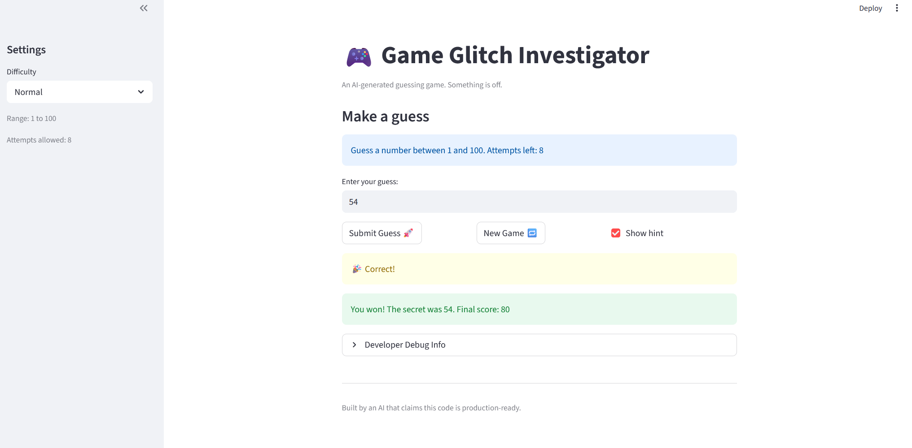

# 🎮 Game Glitch Investigator: The Impossible Guesser

## 🚨 The Situation

You asked an AI to build a simple "Number Guessing Game" using Streamlit.
It wrote the code, ran away, and now the game is unplayable. 

- You can't win.
- The hints lie to you.
- The secret number seems to have commitment issues.

## 🛠️ Setup

1. Install dependencies: `pip install -r requirements.txt`
2. Run the broken app: `python -m streamlit run app.py`

## 🕵️‍♂️ Your Mission

1. **Play the game.** Open the "Developer Debug Info" tab in the app to see the secret number. Try to win.
2. **Find the State Bug.** Why does the secret number change every time you click "Submit"? Ask ChatGPT: *"How do I keep a variable from resetting in Streamlit when I click a button?"*
3. **Fix the Logic.** The hints ("Higher/Lower") are wrong. Fix them.
4. **Refactor & Test.** - Move the logic into `logic_utils.py`.
   - Run `pytest` in your terminal.
   - Keep fixing until all tests pass!

## 📝 Document Your Experience

The purpose of the game is to guess a randomly generated number within a certain range that changes depending on what mode is being played. The user is given a fixed number of attempts and can use hints to understand if they should guess higher or lower than the most recent value guessed.

Some bugs I found were that the hint logic was incorrect. Guesses higher than the secret number would incorrectly tell the player to go higher. The game state also did not reset properly when changing modes. This led to the secret number, history, and score to be reused. Additionally, the code mixed UI and game logic. Furthermore, the "Hard" mode had a smaller range than the "Normal" mode. I also noticed that invalid inputs still counted as attempts and were added to the guess history and that attempts started at 1.

To fix these issues, I used an AI assistant to help correct the comparison logic in the check_guess function so that guesses higher than the secret correctly prompt the player to go lower and vice versa. I also used it to refactor the core game logic into logic_utils.py. To fix the game state issues, I used it to add a proper reset function using session state so that changing difficulty or starting a new game resets the secret number, history, score, and attempts. It also updated the difficulty settings so that "Hard" mode uses a larger range than "Normal," making it more challenging. Additionally, I fixed the input handling so that attempts are only counted for valid guesses and invalid inputs are not added to the history. Finally, I corrected the initial attempt count to start at 0 instead of 1 to accurately reflect the number of guesses made. I verified these fixes by testing the Streamlit app and using pytest to confirm that the guess logic behaved correctly.

## 📸 Demo

